# Tasty Dinery 🍔☕️  

Fully integrated flutter application (both **UI** and **Backend** using **dart flutter** and **firebase**) for restaurant for instantaneous order of food and beverage from anywhere you are, along with seamless online payment using mobile payments. 

The App consist of both the **client/customer** Application and **Admin** with the same entry point but different roles.

**App consists of different screens as will be illustrated later on.**  

Star⭐ the repo if you like what you see 😉.  
<!--  -->

## ScreenShots

### authentication screens

| 1 | 2|
|------|-------|
|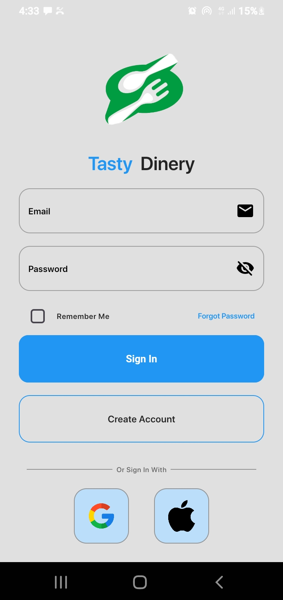|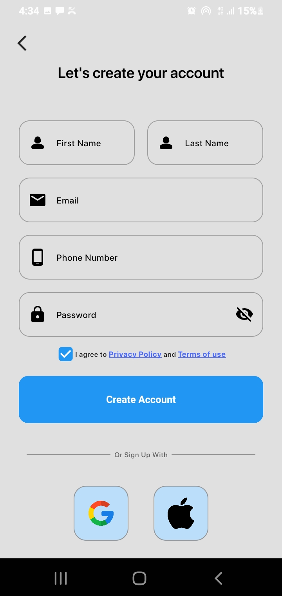|

### client application

| 1 | 2|
|------|-------|
|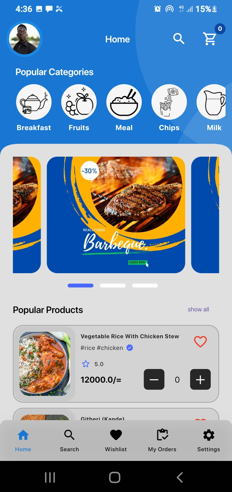|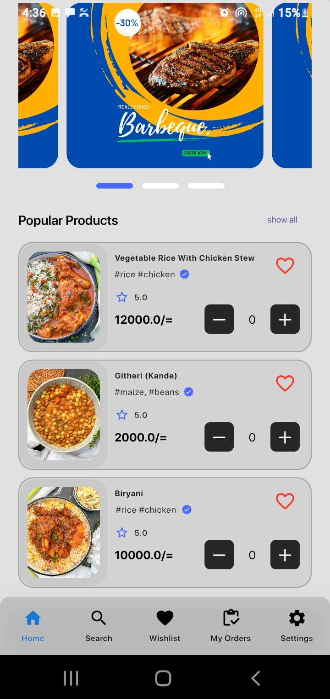|

| 3 | 4|
|------|-------|
|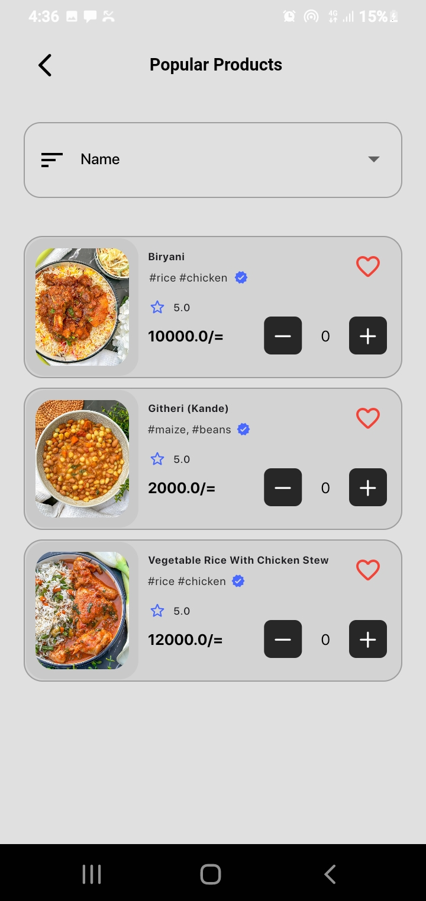|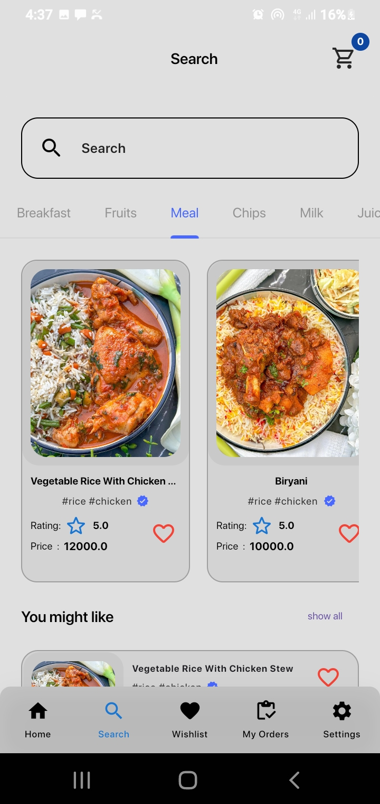|

| 5 | 6|
|------|-------|
|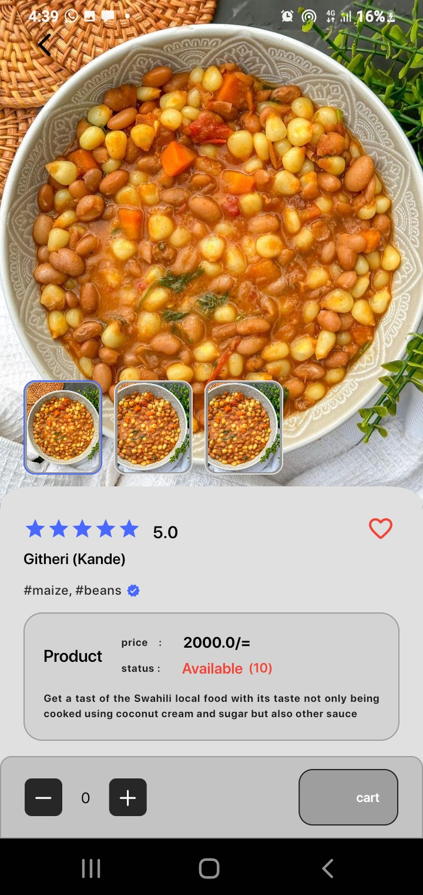|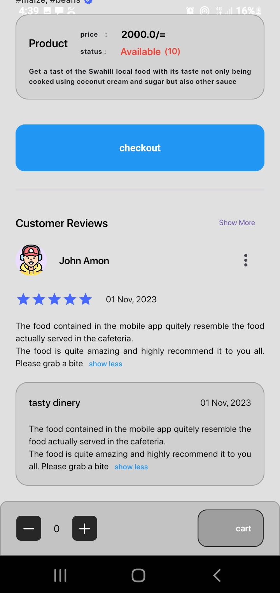|

| 7 | 8|
|------|-------|
|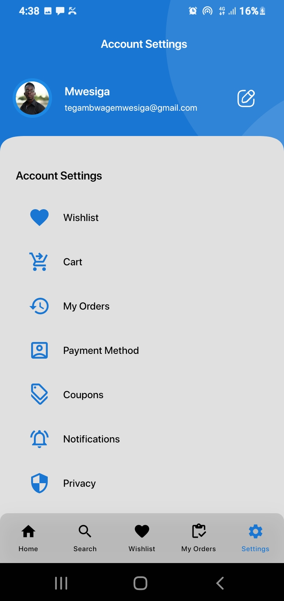|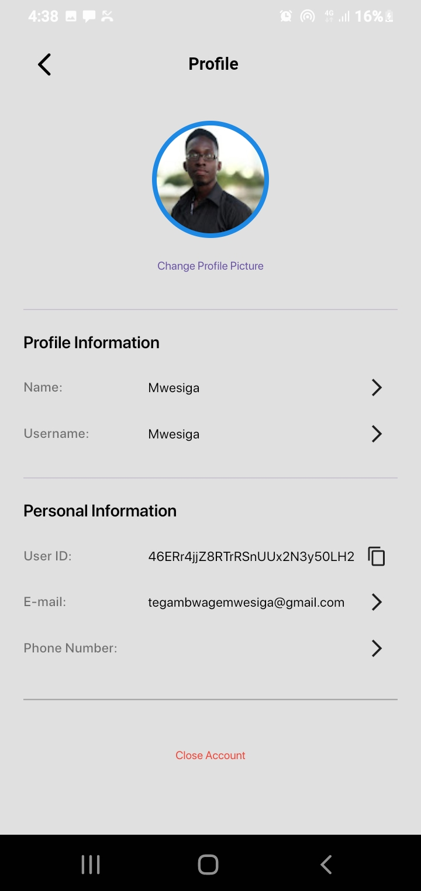|

| 9 | 10|
|------|-------|
|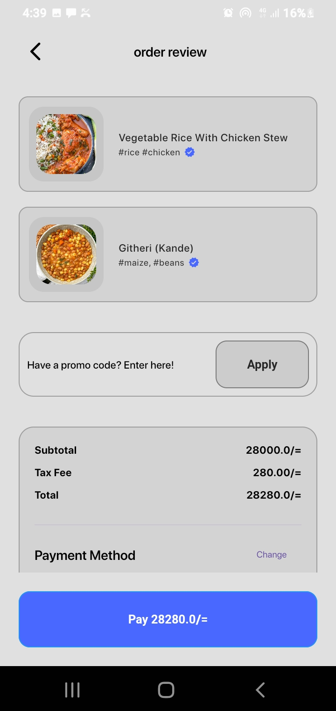||

| 11 | 12|
|------|-------|
|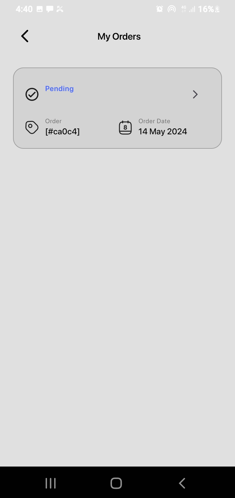|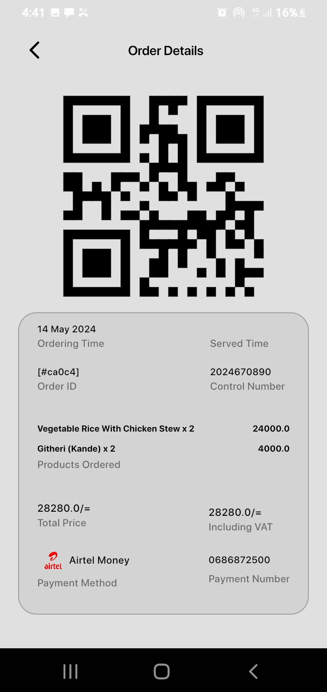|

### admin

| 1 | 2|
|------|-------|
|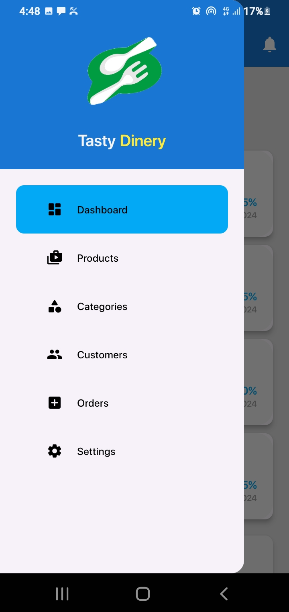|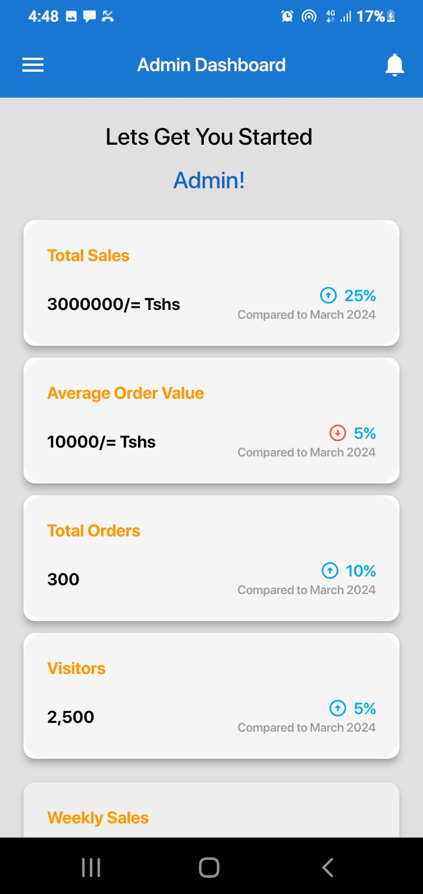|

| 3 | 4|
|------|-------|
|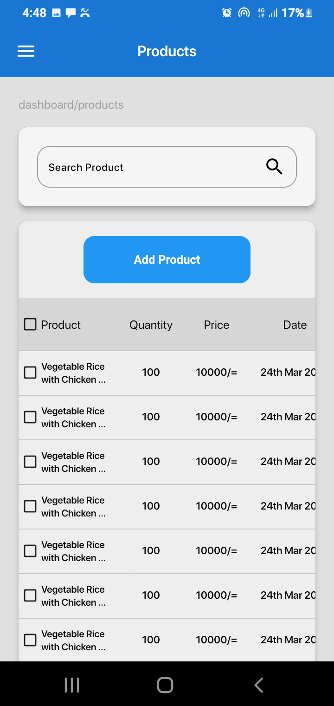|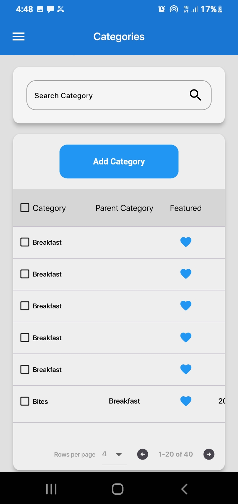|

| 5 | 6|
|------|-------|
|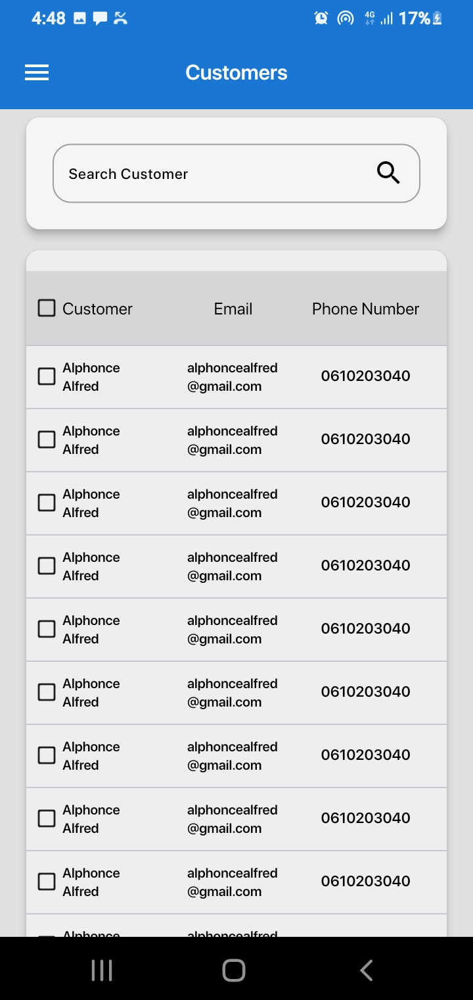|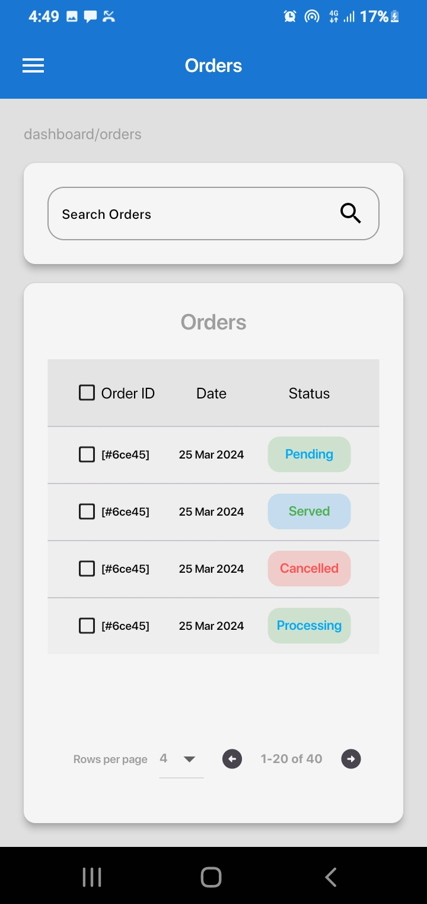|

## ✨ Requirements
* Any Operating System (ie. MacOS X, Linux, Windows)
* Any IDE with Flutter SDK installed (ie. IntelliJ, Android Studio, VSCode etc)
* A little knowledge of Dart and Flutter
* A brain to think 🤓🤓

## 🤓 Author(s)
**Mwesiga Tegambwage** 

## Getting Started

This project is a starting point for a Flutter application.

A few resources to get you started if this is your first Flutter project:

- [Lab: Write your first Flutter app](https://flutter.io/docs/get-started/codelab)
- [Cookbook: Useful Flutter samples](https://flutter.io/docs/cookbook)

For help getting started with Flutter, view our 
[online documentation](https://flutter.io/docs), which offers tutorials, 
samples, guidance on mobile development, and a full API reference.